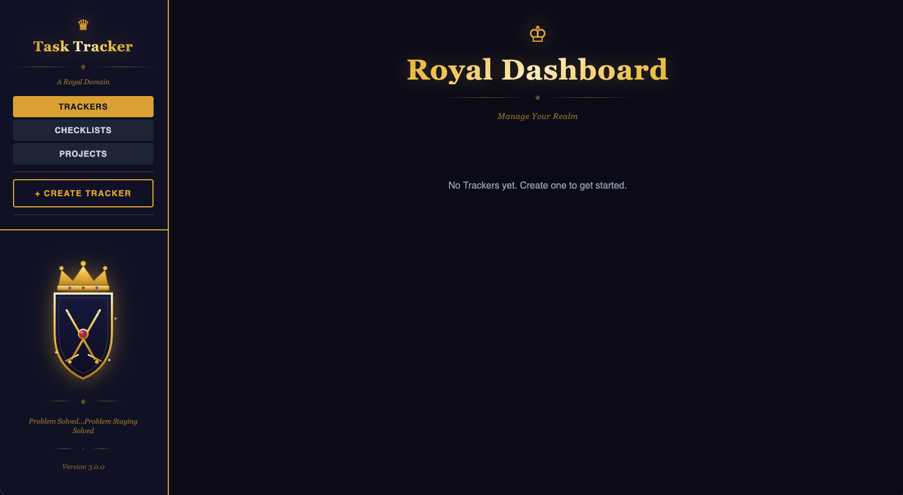

# Task Tracker

A versatile, elegant task tracking dashboard and organizer built with modern web technologies. Designed to help you manage projects, efforts, and initiatives with a royal aesthetic.  It's Royal because you are the King or Queen in this Realm!  Manage it like you rule a kingdom and want to keep things in order.

NOTE:  More features are planned, and will be added as time permits.  Keep checking back for updates, and please provide feedback, suggestions, or feature requests.  

## About

Task Tracker is a full-stack web application that provides a comprehensive solution for organizing and tracking tasks across multiple projects or efforts. Whether you're managing work initiatives, personal projects, or any other tracking needs, Task Tracker offers a clean, intuitive interface with powerful organizational features.

The application is built with a flexible architecture that separates concerns into:
- **Backend API**: A fast, async-first REST API built with FastAPI
- **Frontend Dashboard**: A modern React + TypeScript interface with Tailwind CSS styling
- **Database**: SQLAlchemy ORM with Alembic migrations for schema management

## Key Features

- **Multiple Tracker Support**: Create and manage multiple trackers (projects, efforts, initiatives)
- **Task Management**: Organize tasks within each tracker with:
  - Task titles
  - Severity levels (1-10 with color coding: Green for low severity → Red for critical)
  - Completion tracking with toggle checkbox
  - Drag-and-drop task reordering
- **Dynamic Checklists**: Create reusable checklist templates with:
  - Templating and cloning for rapid deployment
  - Multi-device/item management with hierarchical steps
  - Text and command step types with copy-to-clipboard
  - Completion tracking with timestamps and audit reports
  - Hide/show command functionality with display text labels
- **Notes System**: Add rich text notes to tasks with title and date tracking
- **Responsive Design**: Beautiful, dark-themed UI with a royal aesthetic
- **Real-time Updates**: Built with React Query for efficient data fetching and caching
- **Type-Safe**: Full TypeScript implementation for both frontend and backend

## Tech Stack

### Backend
- **FastAPI** - Modern, fast web framework for building APIs
- **SQLAlchemy** - SQL toolkit and Object Relational Mapper
- **Alembic** - Database migration tool
- **Uvicorn** - ASGI server
- **Pydantic** - Data validation using Python type hints
- **SQLite/PostgreSQL** - Database support (SQLite for development, PostgreSQL for production)

### Frontend
- **React** 19 - UI library
- **TypeScript** - Type-safe JavaScript
- **Vite** - Next generation frontend tooling
- **Tailwind CSS** - Utility-first CSS framework
- **React Router** v6 - Client-side routing
- **TanStack Query** (React Query) - Server state management
- **Zustand** - Client state management
- **React Hot Toast** - Toast notifications

## Getting Started

### Prerequisites
- Python 3.11+
- Node.js 18+
- npm or yarn

### Installation

1. **Clone the repository**
   ```bash
   git clone https://github.com/yourusername/Task-Tracker.git
   cd Task-Tracker
   ```

2. **Set up Python environment**
   ```bash
   python3 -m venv .venv
   source .venv/bin/activate  # On Windows: .venv\Scripts\activate
   ```

3. **Install backend dependencies**
   ```bash
   pip install -r backend/requirements.txt
   ```

4. **Configure environment**
   ```bash
   cp env.example.txt .env
   # Edit .env with your configuration
   ```

5. **Apply database migrations**
   ```bash
   cd backend
   alembic upgrade head
   cd ..
   ```

6. **Install frontend dependencies**
   ```bash
   cd frontend
   npm install
   cd ..
   ```

### Running the Application

#### Development Mode

**Terminal 1 - Backend API**
```bash
source .venv/bin/activate
cd backend
uvicorn app.main:app --host 0.0.0.0 --port 8000 --reload
```

**Terminal 2 - Frontend Dev Server**
```bash
cd frontend
npm run dev
```

The application will be available at:
- **Frontend**: http://localhost:5173
- **Backend API**: http://localhost:8000
- **API Documentation**: http://localhost:8000/docs

#### Production Build

**Frontend:**
```bash
cd frontend
npm run build
```

**Backend:**
```bash
cd backend
uvicorn app.main:app --host 0.0.0.0 --port 8000
```

## Project Structure

```
Task-Tracker/
├── backend/
│   ├── alembic/              # Database migrations
│   ├── app/
│   │   ├── main.py          # FastAPI application entry point
│   │   ├── models.py        # SQLAlchemy ORM models
│   │   ├── schemas.py       # Pydantic request/response schemas
│   │   ├── crud.py          # Database operations
│   │   └── routers/         # trackers, tasks, notes route handlers
│   ├── requirements.txt      # Python dependencies
│   └── alembic.ini          # Alembic configuration
├── frontend/
│   ├── src/
│   │   ├── components/      # React components
│   │   ├── hooks/           # Custom React hooks
│   │   ├── pages/           # Page components
│   │   ├── stores/          # Zustand state stores
│   │   ├── types.ts         # TypeScript type definitions
│   │   └── App.tsx          # Main app component
│   ├── package.json         # Node dependencies
│   └── vite.config.ts       # Vite configuration
├── docker-compose.yml       # Docker composition for production
├── Dockerfile               # Application containerization
└── README.md               # This file
```

## API Documentation

The backend provides a comprehensive REST API. Once running, visit:
- **Swagger UI**: http://localhost:8000/docs
- **ReDoc**: http://localhost:8000/redoc

### Main Endpoints

### Trackers

- `GET /api/v1/trackers` - List all trackers
- `POST /api/v1/trackers` - Create a new tracker
- `GET /api/v1/trackers/{id}` - Get tracker details
- `PATCH /api/v1/trackers/{id}` - Update a tracker
- `DELETE /api/v1/trackers/{id}` - Delete a tracker

### Tasks

- `GET /api/v1/trackers/{id}/tasks` - List tasks for a tracker
- `POST /api/v1/trackers/{id}/tasks` - Create a task
- `PATCH /api/v1/tasks/{id}` - Update a task
- `DELETE /api/v1/tasks/{id}` - Delete a task

### Notes

- `GET /api/v1/tasks/{id}/notes` - List notes for a task
- `POST /api/v1/tasks/{id}/notes` - Create a note
- `GET /api/v1/notes/{id}` - Get a note
- `PATCH /api/v1/notes/{id}` - Update a note
- `DELETE /api/v1/notes/{id}` - Delete a note

### Checklists

- `GET /api/v1/checklists` - List all checklists (with optional filters: `is_template`, `search`)
- `POST /api/v1/checklists` - Create a new checklist or template
- `GET /api/v1/checklists/{id}` - Get checklist details
- `PUT /api/v1/checklists/{id}` - Update a checklist (items, steps, completion)
- `DELETE /api/v1/checklists/{id}` - Delete a checklist
- `POST /api/v1/checklists/{id}/clone` - Clone a template with device list
- `POST /api/v1/checklists/undo` - Undo the last deletion

## Configuration

### Environment Variables

Create a `.env` file based on `env.example.txt`:

```env
# Environment Configuration
ENVIRONMENT=development
DEBUG=true

# Database Configuration (SQLite for development)
DATABASE_URL=sqlite+aiosqlite:///./taskdb.db

# PostgreSQL (production)
# DATABASE_URL=postgresql+asyncpg://user:password@db:5432/taskdb
```

## Database Migrations

Manage database schema with Alembic:

```bash
cd backend

# Create a new migration
alembic revision --autogenerate -m "Description of changes"

# Apply migrations
alembic upgrade head

# Rollback last migration
alembic downgrade -1
```

## Contributing

Contributions are welcome! Please feel free to submit a Pull Request.

## License

This project is licensed under the MIT License - see the [LICENSE](LICENSE) file for details.

## Contributors

This project is developed through equal collaboration between:
- **Claude (Haiku 4.5)** - Implementation & Development
- **Hermes-Agent** - Architecture & Strategy

For detailed contributor roles and contributions, see [CONTRIBUTORS.md](CONTRIBUTORS.md).

## Development Notes

- The application uses SQLite for development (auto-created) and supports PostgreSQL for production
- Frontend builds to a `dist/` folder which can be served by the backend or a separate web server
- All API responses follow a consistent JSON structure for predictable client handling
- The backend includes comprehensive error handling and validation

## Version History

### v1.0 - Task Tracking Foundation

- Multiple tracker support (projects, efforts, initiatives)
- Task management with severity levels (1–10, color-coded green → red)
- Drag-and-drop task reordering
- Completion tracking with toggle checkbox
- Rich text notes system with title and date tracking
- Dark-themed UI with royal aesthetic

### v2.0 - Checklist System

- Dynamic checklist feature with reusable template support
- Checklist cloning for rapid multi-device/item deployment
- Hierarchical steps with text and command step types
- Copy-to-clipboard for command steps with optional display text labels
- Hide/show command functionality
- Completion tracking with timestamps and audit/completion reports

### v3.0.0 - Projects & API Security

- Projects feature with full CRUD — create, edit, delete, and list projects
- Ordered steps with TipTap rich-text content editor per step
- Code block support with syntax highlighting and copy-to-clipboard in step content
- Per-step references section for storing hyperlinks with title and description
- Drag-to-reorder steps within a project
- Step completion toggling with auto-expand to next incomplete step
- Progress bar and completion badge on project tiles
- Incomplete-only filter and search on the projects listing page
- Bearer token API authentication — all endpoints protected via `Authorization: Bearer`
- Runtime token injection via `/config.js` — no secrets baked into the Docker image
- MCP-ready API design with full CRUD endpoints for all resources



## Co-Authored By

- **Claude (Haiku 4.5)** - AI assistant by Anthropic
- **Hermes Agent** - Collaborative agent for architectural decisions and multi-phase implementation
